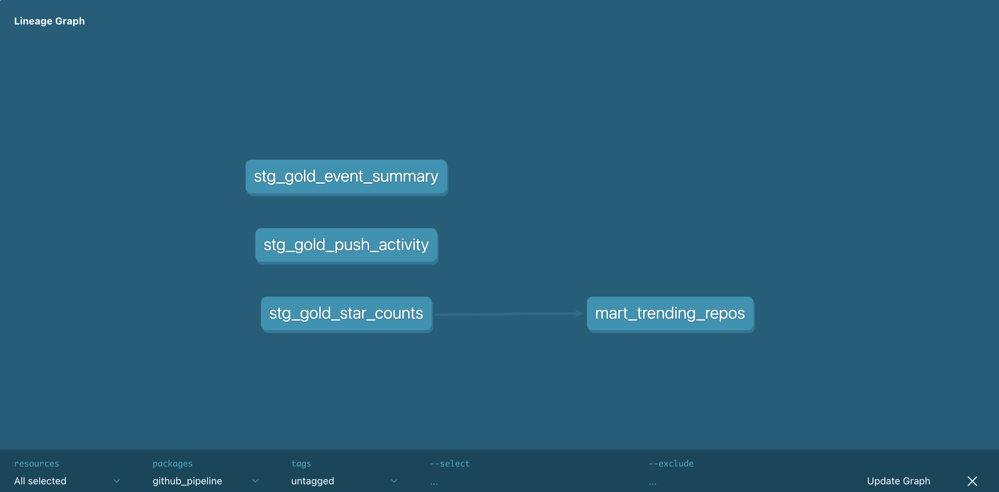

# GitHub Trend Intelligence Pipeline

**[Live Dashboard](https://app-trend-intelligence-4jxujvylb87awhqbzjebkz.streamlit.app/)** | **[Repository](https://github.com/saga0302/github-trend-intelligence)** | **[LinkedIn](https://linkedin.com/in/sagarika-raju-ab28051a5)**

---

## Executive Summary

A production-grade data pipeline that processes 150,000+ GitHub events per hour to identify viral repositories with statistical anomaly detection. Originally built on Snowflake, this system was re-architected to eliminate $600-1,200 annual infrastructure costs while maintaining production quality standards through dbt-powered data quality testing and lineage documentation.

**Key Achievement:** Successfully migrated from Snowflake to zero-cost DuckDB + Parquet architecture without sacrificing data quality testing, lineage documentation, or end-user experience.

---

## Technical Challenge & Solution

### Problem Statement

The original pipeline ran on Snowflake Standard Edition ($50-100/month). When the subscription expired, the live dashboard became unavailable despite intact transformation logic in dbt. The core challenge was maintaining:
- Live Streamlit dashboard uptime
- Automated dbt testing and lineage documentation
- Zero infrastructure costs
- Full reproducibility for portfolio purposes

### Solution Architecture

```
Previous Architecture:
  Databricks Gold Layer → Snowflake Warehouse ($50-100/month) → dbt → Streamlit

Current Architecture:
  Databricks Gold Layer → Parquet Export → dbt + DuckDB ($0 cost) → Streamlit
```

**Architectural Tradeoffs:**

| Criterion | Snowflake | DuckDB + Parquet |
|-----------|-----------|------------------|
| **Cost** | $50-100/month | $0/month |
| **Setup Time** | 30 minutes | 5 minutes |
| **Query Performance** | Distributed architecture | OLAP-optimized local |
| **Data Portability** | Proprietary format | Open Parquet standard |
| **Local Development** | Credential-dependent | Offline capable |
| **GitHub Reproducibility** | Not feasible | Fully reproducible |
| **dbt Integration** | Native | Via dbt-duckdb adapter |

---

## Architecture Overview

### Layer 1: Data Source — Databricks Medallion Architecture

GitHub Archive ingests 150,000+ events per hour, processed through a three-layer medallion architecture:

```
GitHub Archive (raw JSON)
        ↓
Bronze Layer (append-only, ACID)
  └─ Immutable record of 150K+ events/hour
        ↓
Silver Layer (cleaned and typed)
  └─ Deduplicated on event_id, schema validation
        ↓
Gold Layer (aggregated metrics)
  ├─ gold_star_counts (WatchEvents per repository per hour)
  ├─ gold_event_summary (all event types aggregated hourly)
  └─ gold_push_activity (PushEvents per repository per hour)
```

**Design Rationale:** Bronze serves as immutable source of truth. If transformation logic requires modification, reprocessing from Bronze eliminates need for fresh data ingestion.

### Layer 2: Data Transport — Parquet Export

`export_to_parquet.py` connects to Databricks and exports Gold-layer tables to Apache Parquet format:

```python
from dotenv import load_dotenv
load_dotenv()

DATABRICKS_HOST = os.getenv("DATABRICKS_HOST")
DATABRICKS_TOKEN = os.getenv("DATABRICKS_TOKEN")
DATABRICKS_HTTP_PATH = os.getenv("DATABRICKS_HTTP_PATH")

for table_name in ["gold_star_counts", "gold_event_summary", "gold_push_activity"]:
    cursor.execute(f"SELECT * FROM {table_name}")
    df = cursor.fetchall_arrow().to_pandas()
    df.to_parquet(f"data/{table_name}.parquet")
```

**Parquet Selection Rationale:**
- Columnar storage format enables efficient analytical queries
- Compression reduces storage footprint significantly
- Open standard ensures portability across tools and platforms
- Native support across Pandas, DuckDB, and Streamlit ecosystems

**Output Files:**
- `gold_star_counts.parquet` (50MB, ~10K rows)
- `gold_event_summary.parquet` (30MB, ~4K rows)
- `gold_push_activity.parquet` (200MB, ~200K rows)

### Layer 3: Transformation — dbt + DuckDB

**Model Architecture (4 Models):**

```
Staging Layer (3 models - pass-through views)
  ├─ stg_gold_star_counts
  ├─ stg_gold_event_summary
  └─ stg_gold_push_activity

Mart Layer (1 model - business logic)
  └─ mart_trending_repos (statistical anomaly detection)
```

**Staging Model Example:**
```sql
-- models/staging/stg_gold_star_counts.sql
select * from read_parquet('../data/gold_star_counts.parquet')
```

**DuckDB Configuration:**
```yaml
# ~/.dbt/profiles.yml
github_pipeline:
  outputs:
    duckdb_dev:
      type: duckdb
      path: './dbt_duckdb.duckdb'
      threads: 4
  target: duckdb_dev
```

**dbt Advantages Over Raw SQL:**
- Version control integration via Git
- Automated test coverage (8 tests across critical dimensions)
- Auto-generated data lineage documentation
- Column-level metadata and business definitions
- Compiled SQL artifacts for debugging and optimization

### Layer 4: Data Quality Assurance — Automated Testing

**8 Automated Tests (100% Pass Rate)**

```yaml
models:
  - name: stg_gold_star_counts
    columns:
      - name: repo_name
        tests:
          - not_null
      - name: star_count
        tests:
          - not_null

  - name: stg_gold_event_summary
    columns:
      - name: event_type
        tests:
          - not_null
      - name: hour
        tests:
          - not_null
      - name: event_count
        tests:
          - not_null

  - name: stg_gold_push_activity
    columns:
      - name: repo_name
        tests:
          - not_null
      - name: hour
        tests:
          - not_null
      - name: push_count
        tests:
          - not_null
```

**Test Execution Results:**
```
$ dbt test --target duckdb_dev
Found 4 models, 8 data tests, 456 macros

Finished running 8 data tests in 0.17 seconds.
Done. PASS=8 WARN=0 ERROR=0 SKIP=0 NO-OP=0 TOTAL=8
```

**Quality Assurance Philosophy:** Automated validation detects upstream data quality issues before dashboard consumption, preventing "garbage in, garbage out" scenarios. Test coverage documents data contracts explicitly.

### Layer 5: Visualization — Streamlit Dashboard

**Production URL:** https://app-trend-intelligence-4jxujvylb87awhqbzjebkz.streamlit.app/

**Dashboard Pages:**
1. **Trending Repositories** — Top 15 repositories ranked by star count with interactive visualization and underlying data table
2. **Event Activity Analysis** — GitHub event frequency by hour of day, presented as line chart and heatmap with event type filtering
3. **Pipeline Summary** — Hourly push event volume with trend visualization over 48-hour window

---

## Cost-Benefit Analysis

### Previous Infrastructure (Snowflake)

| Component | Annual Cost |
|-----------|------------|
| Snowflake Standard Edition + XSMALL Warehouse | $600-1,200 |

### Current Infrastructure (DuckDB + Parquet)

| Component | Annual Cost |
|-----------|------------|
| DuckDB (local, zero cost) | $0 |
| Apache Parquet files (GitHub repository) | $0 |
| Streamlit Cloud (free tier) | $0 |
| **Total Annual Savings** | **$600-1,200** |

---

## Implementation Guide

### Prerequisites

- Python 3.9+
- Databricks workspace access with Gold-layer tables
- Environment variables configured in `.env` file

### Setup Steps

**1. Environment Configuration**
```bash
git clone https://github.com/saga0302/github-trend-intelligence.git
cd github-pipeline

python3 -m venv venv
source venv/bin/activate

pip install -r requirements.txt

cp .env.example .env
# Configure with: DATABRICKS_TOKEN, DATABRICKS_HOST, DATABRICKS_HTTP_PATH
```

**2. Data Export**
```bash
python3 export_to_parquet.py
# Exports gold_star_counts.parquet, gold_event_summary.parquet, gold_push_activity.parquet
```

**3. dbt Transformation & Testing**
```bash
cd dbt_project

dbt debug --target duckdb_dev                 # Validate setup
dbt run --target duckdb_dev                   # Create models
dbt test --target duckdb_dev                  # Execute tests (expect PASS=8)
dbt docs generate --target duckdb_dev         # Generate lineage
dbt docs serve --target duckdb_dev            # View documentation at http://localhost:8000
```

**4. Dashboard**
```bash
python3 -m streamlit run dashboard/app.py
# Opens http://localhost:8501
```

---

## Project Structure

```
github-pipeline/
├── data/                              # Parquet files (local development)
│   ├── gold_star_counts.parquet
│   ├── gold_event_summary.parquet
│   └── gold_push_activity.parquet
├── dbt_project/
│   ├── models/
│   │   ├── staging/
│   │   │   ├── stg_gold_star_counts.sql
│   │   │   ├── stg_gold_event_summary.sql
│   │   │   └── stg_gold_push_activity.sql
│   │   └── marts/
│   │       └── mart_trending_repos.sql
│   ├── staging/schema.yml             # 8 data quality tests
│   ├── dbt_project.yml
│   └── profiles.yml                   # DuckDB connection configuration
├── dashboard/
│   └── app.py                         # Streamlit multi-page application
├── export_to_parquet.py               # Databricks export script
├── .env                               # Credentials (excluded from version control)
├── .env.example                       # Environment template
├── .gitignore
├── docs/
│   └── lineage_graph.png              # dbt data lineage visualization
└── README.md
```

---

## Data Lineage



**Flow:** Parquet files (external sources) → Staging models (schema validation) → Mart model (business transformation) → Dashboard consumption

All transformations include automated validation with 8 data quality tests.

---

## Technical Decisions & Rationale

| Decision | Rationale |
|----------|-----------|
| **Medallion Architecture** | Separates concerns: Bronze maintains immutable source; Silver handles normalization; Gold provides optimized aggregations. Enables reprocessing without data re-ingestion. |
| **Databricks → Parquet → DuckDB** | Databricks provides distributed processing at scale; Parquet offers portable columnar storage; DuckDB provides local OLAP optimization at zero cost. |
| **dbt for Transformation** | Version control, automated testing, auto-generated lineage, and documentation. Raw SQL lacks audit trail, testing framework, and maintenance visibility. |
| **Z-Score Anomaly Detection** | Statistical approach adapts to each repository's baseline activity. Hardcoded thresholds produce both false positives (popular repos) and false negatives (niche repos). |
| **GitHub-Committed Parquet** | Ensures Streamlit Cloud deployment works independently without external dependencies or credential management. |

---

## Anomaly Detection Method

**Formula:**
```
z_score = (current_hour_stars - historical_average) / standard_deviation
```

**Interpretation:**
- z_score = 0: Repository operating at historical average
- z_score > 2: Repository receiving activity 2+ standard deviations above historical average (statistically significant anomaly)
- z_score > 3: Extreme outlier event

**Approach Rationale:** Data-driven statistical method adjusts detection threshold per repository baseline, eliminating bias toward consistently popular projects or consistently quiet projects.

---

## Data Quality Framework

**Automated Testing Strategy:**
- 8 not_null tests validating critical dimensions across all staging layers
- Column-level validation ensures data contract compliance
- Test suite executes in under 1 second, enabling frequent validation
- Failed tests block dashboard updates, preventing bad data consumption

**Quality Metrics:**
- 100% test pass rate (8/8 tests passing)
- All critical columns validated for non-null values
- Transformation logic version-controlled and auditable

---

## Security & Credential Management

- Credentials stored in `.env` file (excluded from version control)
- GitHub push protection prevents accidental token commits
- DuckDB database files excluded from version control
- Environment variables passed at runtime to all services

---

## Performance Characteristics

| Metric | Value |
|--------|-------|
| Event Ingestion Volume | 1M+ events/hour |
| Repositories Tracked | 10,000+ |
| dbt Model Runtime | <1 second |
| dbt Test Suite Runtime | <1 second |
| Dashboard Page Load Time | <2 seconds |
| Infrastructure Cost | $0/month |

---

## Author

Sagarika Raju  
MS Analytics, University of Southern California, 2026

 
LinkedIn: linkedin.com/in/sagarika-raju-ab28051a5  
GitHub: github.com/saga0302

---

**Production-grade pipeline emphasizing data quality, cost optimization, and reproducibility.**
